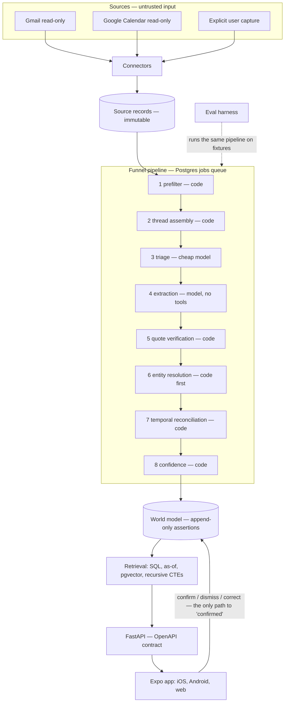

# Architecture

The full rationale is in `TECHNICAL_BRIEF.md`. This page is the map.

## Code layout

| Path | Contents |
|---|---|
| `backend/src/pwm/sources.py` | `SourceRecord`: what connectors produce and the pipeline consumes |
| `backend/src/pwm/extraction/` | `Candidate` schema, `Triager`/`Extractor` protocols, quote verification, prompt assembly, the Anthropic adapter, provider factory |
| `backend/src/pwm/pipeline/` | the funnel: `prefilter`, `text` (visible text), `heuristic` (rule-based stages), `resolution` (people), `world` (reconcile, confidence, as-of), `core` (pure orchestration), `store` (persistence + stage cache), `worker` (jobs) |
| `backend/src/pwm/review.py` | confirm / dismiss / correct / status, merge / split people — the only writer of `review` |
| `backend/src/pwm/db/` | SQLAlchemy models and session |
| `backend/src/pwm/api/` | FastAPI app: commitments list, assertion inspection, review actions, OpenAPI export |
| `backend/migrations/` | Alembic migrations |
| `eval/pwm_eval/` | gold label schema, metrics, systems under test, runner, golden-set labeller |
| `fixtures/generate.py` | deterministic generator for `fixtures/synthetic/` |
| `app/` | Expo app; `src/api/schema.d.ts` is generated from the backend's OpenAPI schema |

## Boundaries that must hold

- Business logic imports `pwm.extraction.interface`, never a model provider's SDK.
- The app imports generated API types, never hand-written ones. `backend/tests/test_openapi_contract.py` fails when the committed schema is stale.
- A system under evaluation receives sources and the user's identity — never gold labels.
- Nothing but a user action writes `review`.
